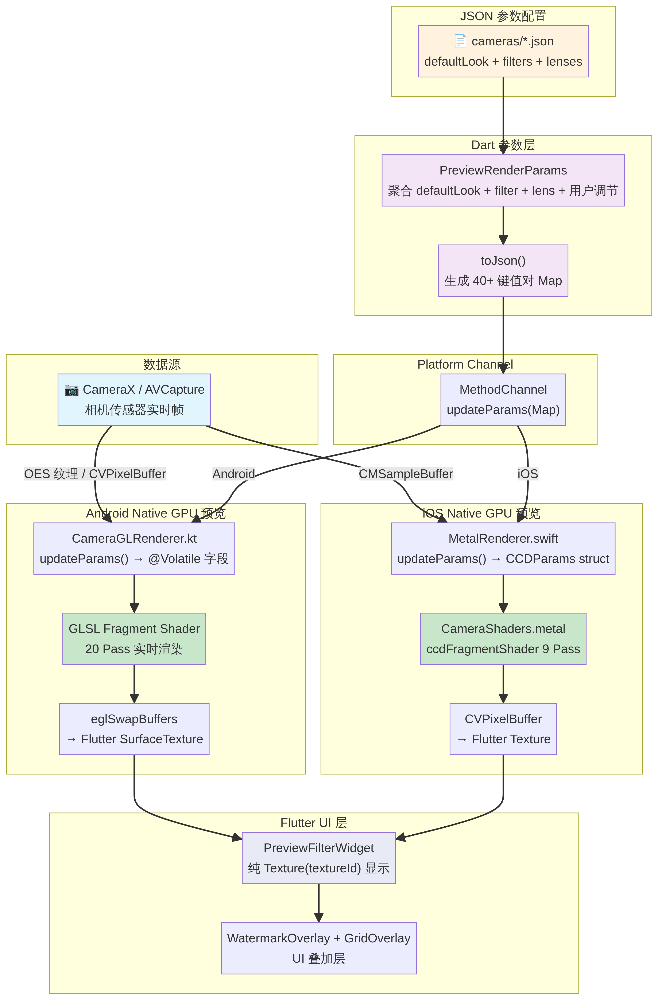
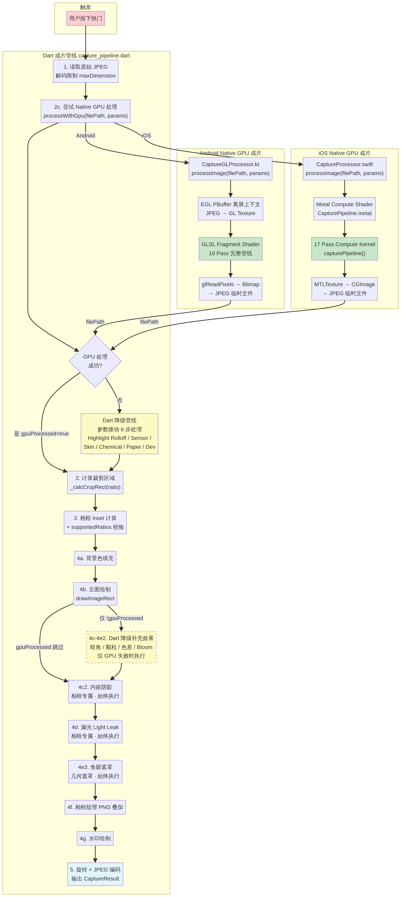

# DAZZ Retro Camera

> A production-grade retro / CCD camera simulator app for iOS and Android, built with Flutter + Swift/Metal + Kotlin/OpenGL ES.
>
> 一款基于 Flutter + Swift/Metal + Kotlin/OpenGL ES 构建的专业级复古相机模拟器，支持 iOS 与 Android 双平台。

---

## Product Overview / 产品概述

DAZZ Retro Camera is a **real-time retro camera simulator** — not a post-processing filter app. Users select a virtual camera, see the retro effect live in the viewfinder, shoot, and get the final image instantly. The experience mirrors the feel of shooting with a real CCD camera, film camera, instant camera, or VHS camcorder.

DAZZ Retro Camera 是一款**实时复古相机模拟器**，而非后期滤镜应用。用户选择虚拟相机后，可在取景框中实时预览复古效果，按下快门即刻获得成片。整体体验高度还原了真实 CCD 相机、胶片相机、拍立得和 VHS 摄像机的拍摄感受。

### User Flow / 使用流程

```
Launch App → Select Camera → Real-time Preview → Shoot → Instant Result → Save / Share
启动应用  →   选择相机   →    实时取景预览   → 拍摄 →    即时成片    →  保存/分享
```

---

## Technology Stack / 技术栈

| Layer / 层级 | Technology / 技术 | Responsibility / 职责 |
|---|---|---|
| **UI / State / Routing** | Flutter 3.x + Dart | All screens, navigation, state management (Riverpod) / 所有界面、路由、状态管理 |
| **iOS Native** | Swift 5.9 + AVFoundation + Metal | Camera capture, real-time GPU rendering / 相机采集、实时 GPU 渲染 |
| **Android Native** | Kotlin + CameraX + OpenGL ES 3.0 | Camera capture, real-time GPU rendering / 相机采集、实时 GPU 渲染 |
| **Plugin Bridge** | Flutter MethodChannel + EventChannel | Dart ↔ Native communication / Dart 与 Native 通信 |

> **Constraint / 约束**: Dart/Flutter does **not** perform any pixel-level processing. All GPU rendering lives in the native layer. / Dart/Flutter 层**不**执行任何像素级处理，所有 GPU 渲染逻辑全部下沉至 Native 层。

---

## Architecture Overview / 架构概述

After Phase 1 & Phase 2 refactoring, DAZZ Retro Camera has fully migrated to a **parameter-driven unified Native GPU rendering architecture**. The legacy multi-layer rendering model (Flutter Widget effects + `ColorFilter` matrix + per-camera shaders) has been completely replaced, achieving a high degree of consistency between the preview and capture pipelines.

经过 Phase 1 与 Phase 2 的深度重构，DAZZ Retro Camera 已全面迁移至**参数驱动的统一 Native GPU 渲染架构**。原有的多层渲染模式（Flutter Widget 特效层 + `ColorFilter` 矩阵 + 多相机独立 Shader）已被彻底废弃，实现了预览与成片管线的高度统一。

- **Data-driven / 数据驱动**: All camera styles are defined entirely via JSON config files (`defaultLook`, `filters`, `lenses`), eliminating per-camera Pipeline classes and Shader files. / 所有相机的色彩风格与光学特效完全由 JSON 配置文件定义，彻底消除了相机专用的 Pipeline 类与 Shader 文件。
- **Performance-first / 性能优先**: All pixel-level rendering is handled by native GPU shaders on Android (OpenGL ES) and iOS (Metal). Flutter only aggregates parameters and displays the final Texture. / 所有像素级渲染逻辑全部下沉至 Android (OpenGL ES) 与 iOS (Metal) 的底层 GPU 着色器，Flutter 层仅负责参数聚合与最终 Texture 的展示。
- **WYSIWYG / 所见即所得**: Preview and capture share identical color algorithms, ensuring zero color shift between viewfinder and final photo. / 预览与成片共享完全一致的色彩算法，确保成片不发生色偏。

---

## Repository Structure / 仓库结构

```
dazz-retro-camera/
├── flutter_app/                    # Flutter application / Flutter 应用
│   ├── lib/
│   │   ├── main.dart
│   │   ├── app.dart
│   │   ├── core/                   # Theme, constants / 主题、常量
│   │   ├── router/                 # GoRouter configuration / 路由配置
│   │   ├── models/                 # CameraDefinition, OptionItem, etc.
│   │   ├── services/               # CameraService (MethodChannel wrapper)
│   │   └── features/
│   │       ├── camera/             # Camera screen, preview, controls
│   │       ├── gallery/            # Gallery screen / 相册页
│   │       ├── settings/           # Settings screen / 设置页
│   │       └── subscription/       # Subscription / paywall / 订阅页
│   ├── assets/
│   │   └── cameras/                # Camera definition JSON files / 相机 JSON 配置
│   └── pubspec.yaml
│
└── docs/                           # Engineering documentation / 工程文档
    ├── FULL_ENGINEERING_SPEC.md
    ├── Rendering_Pipeline_Architecture.md
    ├── v3_camera_system_architecture.md
    ├── v3_camera_definitions.md
    ├── v3_tri_platform_models_and_api.md
    ├── bridge-api.md
    └── roadmap.md
```

---

## Camera System Design / 相机系统设计

Each camera is a **self-contained JSON entity** (`CameraDefinition`). All options (filters, lenses, frames, ratios, watermarks) are **private to that camera** and never shared across cameras. The `uiCapabilities` field drives the Flutter UI dynamically.

每个相机是一个**自包含的 JSON 实体**（`CameraDefinition`），所有选项（滤镜、镜头、相框、比例、水印）均为该相机私有，不跨相机共享。`uiCapabilities` 字段动态驱动 Flutter UI，仅在相机支持时显示对应选择器。

```json
{
  "id": "ccd_r",
  "name": "CCD R",
  "category": "ccd",
  "defaultLook": {
    "baseLut": "assets/lut/cameras/ccd_r.cube",
    "exposure": 0.0,
    "contrast": 1.12,
    "saturation": 1.14,
    "temperature": -22,
    "tint": -5.0,
    "highlights": -4.0,
    "shadows": 6.0,
    "whites": 10.0,
    "blacks": -8.0,
    "clarity": 2.0,
    "vibrance": 6.0
  },
  "defaultSelection": {
    "filterId": null,
    "lensId": "std",
    "ratioId": "ratio_3_4",
    "frameId": null,
    "watermarkPresetId": "none",
    "extraId": null
  },
  "uiCapabilities": {
    "enableFilter": false,
    "enableLens": true,
    "enableRatio": true,
    "enableFrame": true,
    "enableWatermark": true,
    "enableExtra": false,
    "enableFilmRoll": false
  }
}
```

### Included Cameras / 内置相机（11 款）

| ID | Name | Category | Filters | Lenses | Frames | Ratios |
|---|---|---|---|---|---|---|
| `bw_classic` | 黑白经典 | film | 2 | 5 | 0 | 3 |
| `ccd_r` | CCD R | ccd | 0 | 5 | 6 | 4 |
| `cpm35` | CPM35 | film | 3 | 3 | 6 | 3 |
| `d_classic` | D Classic | digital | 0 | 4 | 6 | 4 |
| `fisheye` | FISHEYE | creative | 0 | 3 | 0 | 1 |
| `fqs` | FQS | film | 2 | 4 | 6 | 3 |
| `fxn_r` | FXN-R | film | 3 | 4 | 6 | 3 |
| `grd_r` | GRD R | digital | 0 | 4 | 0 | 4 |
| `inst_c` | INST C | instant | 0 | 3 | 6 | 2 |
| `inst_sqc` | INST SQC | instant | 0 | 3 | 6 | 2 |
| `u300` | U300 | film | 3 | 3 | 6 | 3 |

---

## GPU Rendering Pipeline / GPU 渲染管线

### Preview Pipeline / 预览管线

The preview pipeline targets 60fps real-time rendering. Parameter aggregation happens in Flutter (`PreviewRenderParams`), which serializes 40+ key-value pairs via MethodChannel to the native layer. On Android, `CameraGLRenderer.kt` processes CameraX OES textures in a GLSL Fragment Shader; on iOS, `MetalRenderer.swift` processes AVCapture `CVPixelBuffer` via `CameraShaders.metal`.

预览管线目标是 60fps 实时渲染。Flutter 层的 `PreviewRenderParams` 将相机 JSON 的 `defaultLook`、当前滤镜、镜头及用户实时调节进行合并，通过 MethodChannel 将 40+ 个键值对传至 Native 层。Android 端 `CameraGLRenderer.kt` 在 EGL 线程的 GLSL Fragment Shader 中处理 CameraX 的 OES 纹理；iOS 端 `MetalRenderer.swift` 通过 `CameraShaders.metal` 处理 AVCapture 的 `CVPixelBuffer`。



The Android preview shader executes **20 passes** in strict optical order:

Android 预览 Shader 按严格的光学与色彩逻辑顺序执行 **20 个 Pass**：

| Stage / 阶段 | Pass | Description / 描述 |
|:---:|:---|:---|
| Pre-processing / 预处理 | Pass 0: Sharpen | Unsharp Mask sharpening / Unsharp Mask 锐化 |
| Optics / 光学畸变 | Pass 1: Chromatic Aberration | Lens edge color fringing / 镜头边缘红蓝相差 |
| Base Color / 基础色彩 | Pass 2: Temperature + Tint | White balance / 白平衡调整 |
| | Pass 3: Blacks / Whites | Lightroom-style black/white point / 黑白场控制 |
| | Pass 4: Highlights / Shadows | Highlight recovery & shadow lift / 高光压制与阴影提亮 |
| | Pass 5: Contrast | Basic contrast / 基础对比度 |
| | Pass 6: Clarity | Local midtone contrast / 局部微对比度 |
| | Pass 7: Saturation + Vibrance | Saturation & smart vibrance / 饱和度与智能饱和度 |
| | Pass 8: Color Bias | Per-channel RGB offset / RGB 通道独立偏移 |
| Highlight FX / 高光特效 | Pass 9: Bloom | Highlight glow spread / 高光区域光晕扩散 |
| | Pass 10: Halation | Film anti-halation layer simulation / 胶片防晕层失效红色辉光 |
| | Pass 11: Highlight Rolloff | Soft highlight roll-off / 高光柔和滚落 |
| Sensor / 传感器特性 | Pass 12: Sensor Non-uniformity | Center gain, edge falloff, exposure variation / 中心增亮、边缘衰减、曝光波动 |
| | Pass 13: Skin Protection | HSL-mask skin tone protection / 基于 HSL 遮罩的肤色保护 |
| | Pass 14: Development Softness | Film development softening / 胶片显影轻微柔化 |
| Advanced Color / 高级色彩 | Pass 15: Highlight Rolloff 2 | Secondary rolloff with Tone Curve / 配合 Tone Curve 的二次高光滚落 |
| | Pass 16: Tone Curve | Piecewise linear film characteristic curve / 分段线性胶片特征曲线 |
| Physical Texture / 物理质感 | Pass 17: Paper Texture | Pseudo-random paper texture / 伪随机相纸纹理 |
| | Pass 18: Film Grain | Silver halide grain simulation / 胶片银盐颗粒感 |
| | Pass 19: Digital Noise | Luma + chroma CCD noise / 亮度+色度 CCD 噪点 |
| Finishing / 收尾 | Pass 20: Vignette | Lens vignette (disabled in fisheye mode) / 镜头暗角 |

### Capture Pipeline / 成片管线

The capture pipeline is triggered on shutter press and applies the highest-quality processing to the full-resolution JPEG, including advanced effects not enabled in the preview for performance reasons.

成片管线在用户按下快门后触发，对全分辨率 JPEG 进行最高质量处理，包含部分因性能原因未在预览中启用的高级特效。



1. **Decode / 原始解码**: Read JPEG with resolution limit to prevent OOM. / 读取 JPEG 并限制最大边长，防止 OOM。
2. **GPU Processing / GPU 加速处理**: Android `CaptureGLProcessor.kt` creates an EGL PBuffer offscreen context, uploads JPEG as GL texture, runs the full 19-pass pipeline, and reads back via `glReadPixels`. iOS `CaptureProcessor.swift` calls `CapturePipeline.metal` Compute Shader (17 kernel passes). / Android 创建 EGL PBuffer 离屏上下文执行完整 19 Pass 管线；iOS 调用 Metal Compute Shader 执行 17 个 Kernel Pass。
3. **Dart Fallback / Dart 降级**: If GPU fails, a Dart-side parameter-driven pipeline applies 6 steps as fallback. / GPU 失败时，回退到 Dart 层参数驱动管线，依次应用 6 个步骤。
4. **Crop / 裁剪**: Center crop to the selected aspect ratio. / 根据用户选择的比例进行中心裁剪。
5. **Canvas Compositing / Canvas 合成**: Final assembly on Dart Canvas.

> **Key Design / 关键设计**: GPU and Canvas have strictly separated responsibilities. Effects already handled by the GPU pipeline (Vignette, Grain, Chromatic Aberration, Bloom) are guarded by `!gpuProcessed` to prevent double-application on the Canvas layer. / GPU 与 Canvas 职责严格分离。GPU 管线已处理的效果（暗角、颗粒、色差、Bloom）通过 `!gpuProcessed` 守卫条件，确保不在 Canvas 层被二次叠加。

**Canvas compositing order / Canvas 绘制顺序:**

| Step / 步骤 | Operation / 操作 | Condition / 执行条件 |
|:---:|:---|:---|
| 4a | Background fill / 背景色填充 | Always / 始终 |
| 4b | Main image draw / 主图绘制 | Always / 始终 |
| 4c | Vignette | `!gpuProcessed` |
| 4c3 | Film Grain + Digital Noise / 颗粒 + 噪点 | `!gpuProcessed` |
| 4c2 | Inner shadow / 内嵌阴影 | Frame only / 相框专属 |
| 4d | Light leak / 漏光 | Frame only / 相框专属 |
| 4e | Chromatic Aberration / 色差 | `!gpuProcessed` |
| 4e2 | Bloom / 柔焦 | `!gpuProcessed` |
| 4e3 | Fisheye mask / 鱼眼遮罩 | Fisheye mode / 鱼眼模式 |
| 4f | Frame PNG overlay / 相框纹理叠加 | Frame only / 有相框时 |
| 4g | Watermark / 水印绘制 | When set / 有水印时 |

### Capture-Exclusive Passes / 成片专属 Pass

| Pass | Description / 描述 |
|:---|:---|
| **Highlight Rolloff** | S-curve highlight compression for preserving cloud/sky detail. / S 形曲线压制高光，保留亮部细节色彩层次。 |
| **Center Gain & Edge Falloff** | Simulates physical optical vignetting of vintage lenses. / 模拟老式镜头中心通光量大、边缘衰减严重的物理光学缺陷。 |
| **Chemical Irregularity** | Simulates uneven chemical distribution in instant/film development. / 模拟拍立得或胶片显影过程中化学药水分布不均造成的局部亮度/色彩波动。 |
| **Skin Protection** | Precise HSL skin-tone mask to protect face tones under strong cool-toned filters. / 精确的 HSL 肤色遮罩，在强烈冷色调滤镜下保护人物面部肤色。 |

---

## Key Architecture Improvements / 关键架构改进

- **Removed hardcoded pipelines / 移除硬编码管线**: Deleted 10 Dart `xxx_pipeline.dart` files and 16 per-camera Shader/Renderer files on iOS/Android. All logic converges in a single `capture_pipeline.dart` router. / 删除了 10 个 Dart 端 `xxx_pipeline.dart` 文件及 iOS/Android 共 16 个相机专用 Shader/Renderer 文件，所有逻辑收敛于统一路由。
- **Pushed rendering to native / 渲染逻辑全面下沉**: Removed 5 Flutter-layer effect Widgets (`_ChromaticAberrationLayer`, `_BloomLayer`, etc.) and all `ColorFilter.matrix` calls. / 删除了 5 个 Flutter 层特效 Widget 及所有 `ColorFilter.matrix` 调用，显著降低预览时 CPU 占用。
- **Fixed critical color shift bug / 修复严重色偏 Bug**: Fixed temperature/tint coefficients in `CaptureGLProcessor.kt` that were incorrectly amplified by 333×, resolving blue/orange color shift in FQS, CCD R, and other cameras. / 修复了 `CaptureGLProcessor.kt` 中色温与色调系数被错误放大 333 倍的问题，彻底解决了多款相机的成片色偏。
- **Fixed double-effect application / 修复效果双重叠加**: Added `!gpuProcessed` guards on Canvas Vignette, Grain, Chromatic Aberration, and Bloom steps to prevent re-application after GPU processing. / 在 Canvas 的暗角、颗粒、色差、Bloom 步骤前增加 `!gpuProcessed` 守卫，防止 GPU 处理后的效果被 Canvas 二次叠加。

---

## Getting Started / 快速开始

### Prerequisites / 环境要求

- Flutter SDK 3.19+
- Xcode 15+ (iOS development, Metal debugging)
- Android Studio (Android development, OpenGL ES debugging)
- Physical device recommended for camera and GPU testing / 建议使用真机进行相机与 GPU 测试

### Run / 运行

```bash
cd flutter_app
flutter pub get
flutter run -d <device_id>
```

---

## CI/CD & Release

The project uses GitHub Actions for continuous integration and deployment:

- **Flutter CI**: Runs tests and lints on every push to `main`.
- **Android/iOS Build Check**: Verifies debug builds on every push.
- **Release Workflows**: Triggered automatically when a tag matching `v*.*.*` is pushed. Builds release APK/AAB and creates a GitHub Release draft.

---

## Documentation / 文档

| Document | Description |
|---|---|
| [`docs/FULL_ENGINEERING_SPEC.md`](docs/FULL_ENGINEERING_SPEC.md) | Complete engineering specification / 完整工程规范 |
| [`docs/Rendering_Pipeline_Architecture.md`](docs/Rendering_Pipeline_Architecture.md) | Rendering pipeline architecture guide / 渲染管线架构指南 |
| [`docs/v3_camera_system_architecture.md`](docs/v3_camera_system_architecture.md) | V3 JSON Schema and design principles / V3 架构设计 |
| [`docs/v3_camera_definitions.md`](docs/v3_camera_definitions.md) | Production camera preset definitions / 相机预设定义 |
| [`docs/v3_tri_platform_models_and_api.md`](docs/v3_tri_platform_models_and_api.md) | Dart / Swift / Kotlin models + Bridge API |
| [`docs/bridge-api.md`](docs/bridge-api.md) | MethodChannel / EventChannel API reference |
| [`docs/roadmap.md`](docs/roadmap.md) | Development roadmap / 开发路线图 |

---

## License

MIT License — see [LICENSE](LICENSE) for details.
